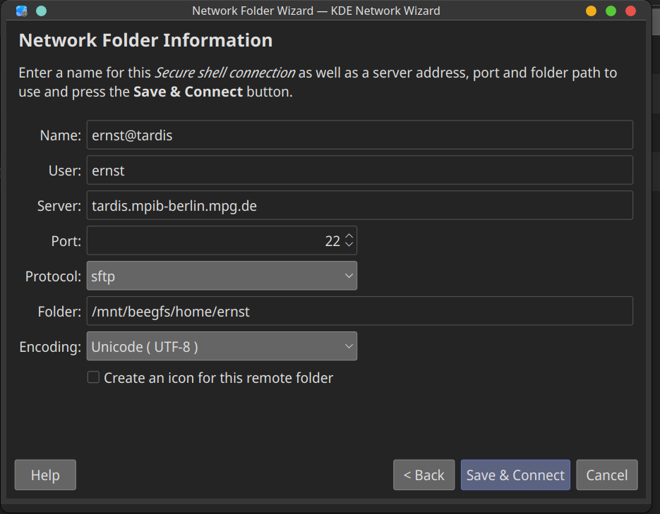

# How to use Julia on TARDIS

In this tutorial, ...

# Set up Cluster
First, you have to connect to the VPN of the MPI:

```console
sudo openconnect vpn.mpib-berlin.mpg.de
```

And then in a new console window to tardis:

```console
ssh xxx@tardis.mpib-berlin.mpg.de
```

As long as you are connected via VPN, you find the tardis documentation [here](https://tardis.mpib-berlin.mpg.de/).

We now need to set up a remote directory. This depends on your os and file manager, but you should find a way to add a remote directory over ssh, and get a dialogue that looks something like this:



# Some slurm basics

Slurm (Simple Linus Utility for Resource Management) is a so-called "resource manager". Basically, you have to tell slurm how many ressources you want to use, and slurm will allocate those resources on the cluster for you. This way, you don't have to think about what specific part of the cluster you want to use (and you don't need extensive knowledge of the cluster architecture). Slurm is also a "job scheduler", meaning if many persons are using the cluster at the same time, slurm schedules the tasks and ensures smooth and fair scheduling of the work.[^1]

We can ask for
- Nodes
    - Sockets
        - Cores
    - GPUs
    - Memory
- Time

From the tardis documentation, we find that we have

- 832 Intel® Xeon® CPU E5-2670 CPU **cores**(no HT) inside 48 Dell m6x0 blade **servers**  
- 7 dedicated **nodes** housing 24 Nvidia **GPUs**  
- 10.6TB total amount of **memory**
- 32TB of attached NFS storage for software
- 747 TB of attached BeeGFS storage

available.

> *Show the tardis docs*

When we log in to the cluster, we are on the so-called "login node", a node that simply exists for the purpose to do "housekeeping" on the cluster. **NEVER** do computations on the login node, as this will make life worse for all other cluster users.

Instead, we submit a slurm job. If we want an interactive job to do some quick testing, we can to something like

```console
srun -p test --pty /bin/bash
```

which gives us a terminal on one of the nodes of the *test* queue.

## Request Resources

To submit a real job, we first need to decide how many resources we need:

- `--time 24:0:0`: After this, the job is terminated
- `--mem 8GB`: Max. memory per node. If you use more than this, your job is terminated.
- `--ntasks`: how many tasks
- `--cpus-per-task 2`: if you want to use multi-threading
- `--mem-per-cpu 4GB`

We then decide what the appropriate partition is:
- `--partition test`: which queue to submit to

The list of partitions can be found [here](https://tardis.mpib-berlin.mpg.de/docs).

We should also submit some general infos
- `--workdir project/data`: working directory of your job
- `--job-name` job-name

There are many more advanced options available (for example `--cores-per-socket`), see the documentation on [sbatch flags](https://slurm.schedmd.com/sbatch.html).

## Quick Test Job

Let's submit an example job:

```console
sbatch job.sh
```

We typically use `srun` to start a quick interactive session, and `sbatch` to submit our jobs to the queue (and have lunch).

Let's see if our job is/has been running

```console
squeue -u ernst
sacct -u ernst
```

Some other usefull slurm commands are
- `scancel JOBID` or `scancel -u $USER`

# Get Julia/Singularity up and running

Some software is preinstalled on the cluster. However, we may want to be able to use software that has not been installed by the admin, or a specific version with specific packages installed. For this purpose, we can use Singularity. 

## From Gitlab

For using Julia, Aaron has built a docker container and hosts it on GitLab:

**DON'T EXECUTE**

```console
singularity pull docker://registry.git.mpib-berlin.mpg.de/peikert/sem-jl-docker:latest
```
To be able to install new julia packages in the container, we need to convert the container to a writeable one (called "sandbox"):

```console
singularity build --sandbox my_container.simg sem-jl-docker_latest.sif
```

## From the Cluster

However, since this takes *forever*, we instead use one of the containers that was build by the admin:

```console
singularity build --sandbox my_container.simg /data/container/julia/julia-1.8.2.sif
```

Let's open a shell:

```console
singularity shell --writable my_container.simg
julia
```

Let's install the package that communicates to slurm for us:

```console
module load julia
julia
using SlurmClusterManager
] add SlurmClusterManager
```

Okay, now let's use Julia interactively with more resources:

```console
srun --partition quick --nodes 2 --ntasks-per-node 2 --cpus-per-task 2 --pty /bin/bash
julia
using Distributed, SlurmClusterManager
addprocs(SlurmManager(); exename = "juliac", dir = "/home/mpib/ernst/ClusterTutorial/julia")
```

Let's run some code:

```console
println("Number of processes: ", nprocs())
println("Number of workers: ", nworkers())

# each worker gets its id, process id and hostname
for i in workers()
    id, pid, host = fetch(@spawnat i (myid(), getpid(), gethostname()))
    println(id, " " , pid, " ", host)
end
```

## From Container to Container

```console
srun --partition quick --nodes 2 --ntasks-per-node 2 --cpus-per-task 2 --pty /bin/bash
singularity shell --writable \
    --bind /home/mpib/ernst/ClusterTutorial:/mnt my_container.simg \
    --bind /etc/slurm-llnl:/etc/slurm-llnl \
    --bind /run/munge:/run/munge
using Distributed, SlurmClusterManager
addprocs(SlurmManager(); exename = "julia", dir = "")
```

# Prepare

- "A future for tardis" https://git.mpib-berlin.mpg.de/peikert/a-future-for-tardis: until R-specific part
- clone repo
- https://maximilian-stefan-ernst.github.io/ClusterTutorial/tutorial

# Footnotes

[^1]: This is partly taken from [this introductory series about slurm on youtube](https://www.youtube.com/watch?v=NH_Fb7X6Db0).